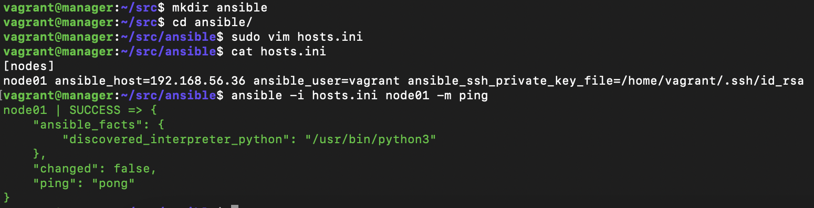

# Инструменты автоматизации

## Содержание

1. [Удаленное конфигурирование узла через Ansible](#part-1-удаленное-конфигурирование-узла-через-ansible)
2. [Service Discovery](#part-2-service-discovery)

## Part 1. Удаленное конфигурирование узла через Ansible

1. **Создание инфраструктуры с помощью Vagrant**

   - Созданы три машины: `manager`, `node01` и `node02`.
   - Прокинуты порты `node01` для доступа к будущему приложению.
   - Машины созданы и запущены с помощью `vagrant up`.

   

   > *Рисунок 1.* Подключение к *manager*

2. **Настройка менеджера для удаленного управления**

   

   > *Рисунок 2.* Сгенерирован SSH-ключ на *manager* и публичный ключ скопирован на *node01*

3. **Копирование исходного кода и файлов конфигурации**

   - Скопирован исходный код приложения и `docker-compose.yml` на **`manager`**.
   - Изменен владелец директории `/home/vagrant/src` на пользователя `vagrant` для дальнейшего удобства работы.

   

   > *Рисунок 3.* Изменен пользователь для `/home/vagrant/src`

   

   > *Рисунок 4.* Скопирован исходный код и `docker-compose.yaml`

4. **Установка Ansible**

   - Установка Ansible на `manager`:

     ``` bash
     sudo apt install ansible
     ```

   - Создана директория `ansible` и файл [hosts.ini](./ansible01/hosts.ini) с инвентарем. Проверено подключение к узлам через *Ansible* модулем `ping`.

   

   > *Рисунок 5.* Соединение прошло успешно

5. **Первый плейбук**

   - Написан плейбук [playbook.yml](./ansible01/playbook.yml) для Ansible, который:
     - Выполняет `apt update`.
     - Устанавливает `docker` и `docker-compose`.
     - Копирует `docker-compose` файл из `manager` на удаленные узлы.
     - Развертывает микросервисное приложение.

   

   > *Рисунок 6.* Содержимое первого плейбука `playbook.yml`

   

   > *Рисунок 7.* Плейбук успешно запущен

6. **Тестирование с помощью Postman**

   

   > *Рисунок 8.* Все тесты *Postman* пройдены успешно

7. **Создание ролей Ansible**

   - Написан новый [плейбук](./ansible01/playbook_roles.yml) с ролями:

     - `application` — разворачивает микросервисное приложение на `node01`.
     - `apache` — устанавливает и запускает Apache на `node02`.
     - `postgres` — устанавливает PostgreSQL на `node02`, создает базу данных и таблицу, а затем добавляет три записи.

   - Обновлен файл инвентаря для работы с двумя узлами и назначены роли в основном плейбуке:

     ```ini
     [nodes]
     node01 ansible_host=192.168.56.39 ansible_user=vagrant ansible_ssh_private_key_file=/home/vagrant/.ssh/id_rsa
     node02 ansible_host=192.168.56.40 ansible_user=vagrant ansible_ssh_private_key_file=/home/vagrant/.ssh/id_rsa
     ```

   

   > *Рисунок 9.* Новый плейбук

   

   > *Рисунок 10.* Успешный результат запуска плейбука

8. **Тестирование ролей**

   - Проверить работоспособность Apache и PostgreSQL:
     - Apache должен быть доступен по HTTP.
     - Подключиться к PostgreSQL и вывести содержимое таблицы.

   

   > *Рисунок 11.* Основная страница *Apache*

   

   > *Рисунок 12.* Созданная таблица на *node02*

## Part 2. Service Discovery

1. **Создание инфраструктуры с помощью Vagrant**

   - Созданы три виртуальные машины: `manager`, `api` и `db`.
   - Прокинут порт `8082` с `api` на локальную машину для доступа к микросервисному приложению.
   - Для удобства подключения и управления, настроен SSH-доступ для каждой машины.

   

   > *Рисунок 13.* Машины подняты и готовы к работе

   

   > *Рисунок 14.* Публичные ключи скопированы на машины `api` и `db`

2. **Написание плейбуков для автоматизации развертывания**

   - Написан [плейбук](./ansible02/playbook.yml) *Ansible* с четырьмя [ролями](./ansible02/roles/):

     - **install_db**:
       - Настраивает узел `db`.
       - Устанавливает PostgreSQL и запускает его.
       - Создает базу данных `hotels_db`.

     - **install_hotels_service**:
       - Настраивает узел `api`.
       - Копирует исходный код микросервиса на машину.
       - Устанавливает Java (`openjdk-8-jdk`).
       - Создает глобальные переменные окружения для подключения к базе данных:
         - `POSTGRES_HOST="127.0.0.1"`
         - `POSTGRES_PORT="5432"`
         - `POSTGRES_DB="hotels_db"`
         - `POSTGRES_USER="<имя пользователя>"`
         - `POSTGRES_PASSWORD="<пароль пользователя>"`
       - Запускает собранный `.jar` файл сервиса с помощью команды:

         ```bash
         java -jar <путь до hotel-service>/hotel-service/target/<имя jar-файла>.jar
         ```

   

   > *Рисунок 15.* Плейбук успешно запущен и все роли выполнены

3. **Проверка работоспособности сервиса**

   - Список отелей: `http://localhost:8082/hotels`

   

   > *Рисунок 16.* Список отелей доступен

   - Список городов: `http://localhost:8082/cities`

   

   > *Рисунок 17.* Список городов доступен

   - Список стран: `http://localhost:8082/countries`

   

   > *Рисунок 18.* Список стран доступен

   - Профиль: `http://localhost:8082/profile`

   

   > *Рисунок 19.* Профиль пользователя доступен

## Заключение

В этом проекте создано и настроено автоматизированное окружение с помощью *Vagrant* и *Ansible* для развертывания микросервисного приложения. Реализованы несколько ролей *Ansible* для установки и настройки базы данных и сервиса отелей, проверена работоспособность всех сервисов.
