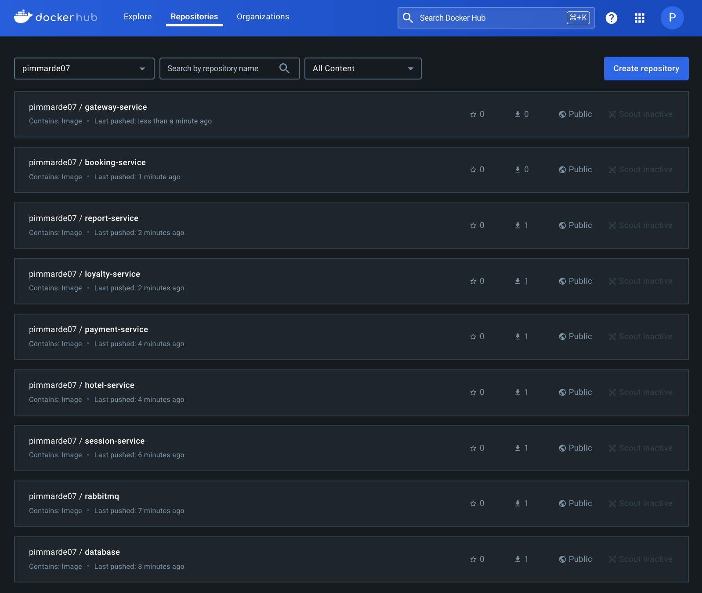

# Основы оркестрации контейнеров

## Содержание

1. [Запуск микросервисов с использованием Docker Compose](#part-1-запуск-микросервисов-с-использованием-docker-compose)
2. [Создание виртуальной среды с помощью Vagrant](#part-2-создание-виртуальной-среды-с-помощью-vagrant)
3. [Настройка и развертывание Docker Swarm](#part-3-настройка-и-развертывание-docker-swarm)

## Part 1. Запуск микросервисов с использованием Docker Compose

1. Написать Dockerfile для каждого микросервиса, включив все необходимые зависимости. В отчете показать различие в размерах собранных образов при использовании различных подходов оптимизации.


> *Рисунок 1.* Сравнение размеров собранных образов

2. Разработать `docker-compose.yml`, который корректно связывает микросервисы между собой, учитывая их взаимодействие. Пробросить порты для доступа к основным сервисам из локальной среды.

3. Собрать и развернуть сервис с помощью `docker-compose` на локальном компьютере.

Для корректной сборки проекта использовались следующие команды:
```bash
mvn -N io.takari:maven:wrapper -Dmaven=3.8.6
./mvnw wrapper:wrapper
```

Далее сборка и запуск сервисов выполнялись командой:
```bash
docker-compose up --build -d
```


> *Рисунок 2.* Сборка и запуск выполнены корректно


> *Рисунок 3.* Все контейнеры успешно запущены

4. Прогнать заранее подготовленные тесты через Postman, чтобы убедиться в корректности работы сервисов.


> *Рисунок 4.* Результаты тестирования в *Postman*

### Проблемы и их решения

1. **Ошибка при запуске Maven Wrapper:** `Error: Could not find or load main class org. apache.maven.wrapper. MavenWrapperMain`
Решение: установили правильную версию Maven Wrapper с помощью:

```bash
mvn -N io.takari:maven:wrapper -Dmaven=3.8.6
```

2. **Ошибка с зависимостями Maven:** `failed to solve: process "/bin/sh -c ./mvnw dependency:go-offline" did not complete successfully`
Решение: обновление Maven Wrapper через:

```bash
./mvnw wrapper:wrapper
```

## Part 2. Создание виртуальной среды с помощью Vagrant

1. Установить и инициализировать Vagrant. Написать `Vagrantfile` для одной виртуальной машины и скопировать исходный код проекта в рабочую директорию виртуальной среды.

После создания *Vagrantfile* возникла проблема с загрузкой образа из Vagrant Cloud, которая была решена с помощью VPN. Ошибка:

>URL: ["https://vagrantcloud.com/bento/ubuntu-22.04"]<br>
Error: The requested URL returned error: 404

После устранения, удалось запустить машину и подключиться к ней:

```bash
vagrant ssh
```


> *Рисунок 5.* Виртуальная машина запущена и готова к работе

2. Остановить и удалить виртуальную машину:

```bash
vagrant halt
vagrant destroy
```

## Part 3. Настройка и развертывание Docker Swarm

1. Изменить `Vagrantfile` для создания трех узлов (manager и два worker). Написать shell-скрипты для установки Docker и инициализации Swarm. Все скрипты были размещены в директории `./scripts/`.


> *Рисунок 6.* Docker Swarm инициализирован на всех узлах

2. Загрузить собранные образы на Docker Hub и адаптировать `docker-compose.yml` для работы с удаленными образами.

Образы загружены с помощью команд:

```bash
docker build -t username/service_name:latest .
docker push username/service_name:latest
```



> *Рисунок 7.* Образы успешно загружены на Docker Hub

3. Запуск стека микросервисов на кластере и настройка взаимодействия между узлами.

```bash
docker stack deploy -c docker-compose.yml stack_name
```


> *Рисунок 8.* Все сервисы запущены и распределены по узлам кластера

4. Настроить Nginx в качестве обратного прокси для маршрутизации запросов к внутренним сервисам.

Конфигурация Nginx настроена и добавлена в `docker-compose.yml`. Сервисы доступны только через Nginx, а прямой доступ к ним заблокирован.


> *Рисунок 9.* Прокси-сервер Nginx настроен корректно

5. Прогон всех тестов Postman и проверка распределения контейнеров по узлам.


> *Рисунок 10.* Все тесты завершились успешно

6. Установить и настроить Portainer для визуализации состояния кластера.

Portainer установлен и развернут в виде отдельного стека:

```bash
docker stack deploy -c portainer-agent-stack.yml portainer
```

Подключение и просмотр результатов:


> *Рисунок 11.* Portainer показывает распределение задач и состояние узлов
