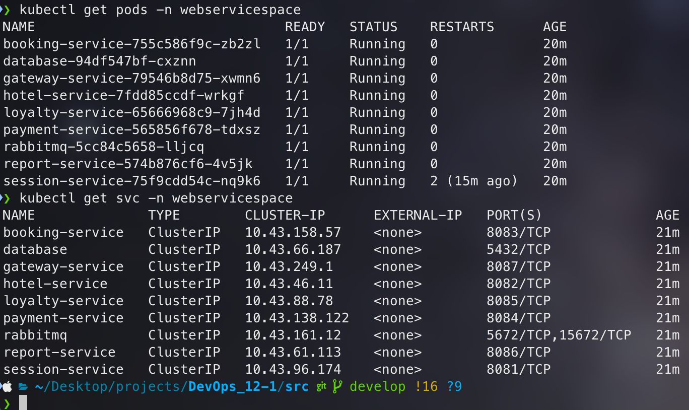

# Helm и Kustomization

## Contents

1. [Развертывание приложения с помощью Kustomize](#part-1-kustomize)
2. [Развертывание приложения с помощью Helm](#part-2-helm)

## Part 1. Kustomize

**1. Получение виртуальных машин с развернутым кластером**

Набор виртуальных машин подготовлен для развёртывания кластера *Kubernetes* с помощью *K3s*:

- [Vagrantfile](./Vagrantfile)


> *Рисунок 1.* Виртуальные машины запущены


> *Рисунок 2.* Установка *k3s* и подключение узлов


> *Рисунок 3.* Кластер успешно настроен

**2. Перенос манифестов из предыдущих блоков**

Перенесены манифесты из [предыдущих проектов](../Kubernetes/) и объединены в два базовых файла `deployment.yaml` и `service.yaml`:

- [service.yaml](./kustomize/base/service.yaml)
- [deployment.yaml](./kustomize/base/deployment.yaml)
- [configMap.yaml](./kustomize/overlays/production/configMap.yaml)
- [secret.yaml](./kustomize/overlays/production/secret.yaml)

**3. Установка Kustomize на локальной машине**

*Kustomize* установлен на локальной машине для сборки и применения конфигураций:

``` bash
brew install kustomize
```


> *Рисунок 4.* *Kustomize* установлен

**4. Создание скелета проекта для *Kustomize***

Созданы базовые и оверлейные директории для управления конфигурациями:


> *Рисунок 5.* Созданный скелет проекта

**5. Базовые и оверлейные конфигурации**

Созданы базовые и оверлейные конфигурации, включая описания сервисов, деплойментов, секретов и configMap.

**base:**<br>
- [service.yaml](./kustomize/base/service.yaml)<br>
- [deployment.yaml](./kustomize/base/deployment.yaml)<br>
- [kustomization.yaml](./kustomize/base/kustomization.yaml)

**overlays/production:**<br>
- [configMap.yaml](./kustomize/overlays/production/configMap.yaml)<br>
- [secret.yaml](./kustomize/overlays/production/secret.yaml)<br>
- [kustomization.yaml](./kustomize/overlays/production/kustomization.yaml)

**6. Создание `replicas-patch.yaml`**

Создан файл `replicas-patch.yaml`, модифицирующий количество реплик для деплоймента `gateway-service` до 3 реплик в `production` окружении.

- [replicas-patch.yaml](./kustomize/overlays/production/replicas-patch.yaml)

**7. Сборка и запуск *Kustomize***

Конфигурация собрана и применена с учетом `production` окружения:

``` bash
kustomize build overlays/production > prod-deployment.yaml
kubectl apply -f prod-deployment.yaml
```


> *Рисунок 6.* Все поды успешно запущены

**8. Запуск тестов Postman**

Тестирование приложения выполнено успешно:


> *Рисунок 7.* Функциональные тесты *Postman* пройдены успешно

## Part 2. Helm

**1. Получение виртуальных машин**


> *Рисунок 8.* Получен тот же набор машин


> *Рисунок 9.* Кластер развернут

**2. Перенос манифестов в Helm**

Перенесены манифесты для использования в Helm-структуре:

- [service.yaml](./webservice/templates/service.yaml)
- [deployment.yaml](./webservice/templates/deployment.yaml)
- [configMap.yaml](./webservice/templates/configMap.yaml)
- [secret.yaml](./webservice/templates/secret.yaml)

**3. Установка Helm на локальной машине**

Helm установлен для управления и развертывания приложений:

``` bash
brew install helm
```


> *Рисунок 9.* Helm установлен

Для того, чтобы подключить *helm* к удаленному кластеру, понадобилось скопировать файл на локальную машину:

```
scp vagrant@192.168.56.10:/home/vagrant/k3s.yaml ~/.kube/config
```

И на локальной машине изменить строку `server: https://127.0.0.1:6443` на `server: https://192.168.56.10:6443`


> *Рисунок 10.* Кластер подключен

**4. Создание Helm-чарта**

Создан чарт приложения `webservice`:

``` bash
helm create webservice
```


> *Рисунок 11.* Структура Helm-чарта создана

**5. Редактирование файла `values.yaml`**

Отредактирован `values.yaml` для определения параметров развертывания.

- [values.yaml](./webservice/values.yaml)

**6. Упаковка Helm-чарта**

*Helm-чарт* упакован в файл `webservice-0.1.0.tgz`:


> *Рисунок 12.* *Helm-чарт* успешно упакован

**7. Развертывание Helm-чарта**

Helm-чарт развернут в новом пространстве имен:

``` bash
kubectl create namespace webservicespace
helm install webservice ./webservice --namespace webservicespace
```


> *Рисунок 13.* *Helm-чарт* успешно развернут

**8. Проверка состояния приложения**

Проверка состояния подов и сервисов:



> *Рисунок 14.* Все поды и сервисы успешно запущены

**9. Обновление Helm-чарта**

Внесены изменения в `values.yaml`, и выполнено обновление с помощью `helm upgrade`:

``` yaml
gatewayservice:
  app: gateway-service
  replicaCount: 2
```

``` bash
helm upgrade webservice ./webservice --namespace webservicespace
```


> *Рисунок 15.* Обновление Helm-чарта выполнено


> *Рисунок 16.* Запущенные поды обновленного чарта

### 10. Тестирование обновленного приложения
Тестирование обновленного приложения выполнено успешно:


> *Рисунок 17.* Все тесты успешно пройдены

## Заключение

В ходе работы было выполнено развертывание приложения в *Kubernetes* с помощью **Kustomize** и **Helm**.

- **Kustomize** показал удобство в управлении конфигурациями и адаптации к разным окружениям, но не поддерживает работу с зависимостями.
- **Helm** предоставил более мощное решение для управления шаблонами, зависимостями и версиями.

Оба инструмента эффективны, и выбор зависит от требований проекта: *Kustomize* для простых конфигураций, *Helm* — для сложных приложений.
