# Advanced Kubernetes

## Содержание

1. [Кластера k3s](#part-1-кластер-k3s)

## Part 1. Кластер k3s

1) **Запуск виртуальных машин для кластера**

Все необходимые виртуальные машины были успешно запущены:

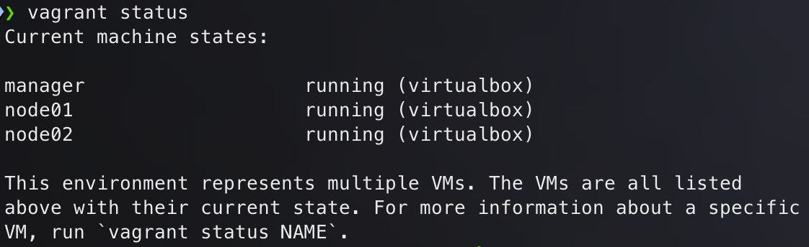

> *Рисунок 1.* Виртуальные машины запущены


2) **Установка k3s на мастер-узле и отключение стандартного Ingress Controller**

На мастер-узле установлен *k3s* без Traefik:

``` bash
curl -sfL https://get.k3s.io | sh -s - --disable=traefik --flannel-iface eth1 --advertise-address 192.168.56.10
```

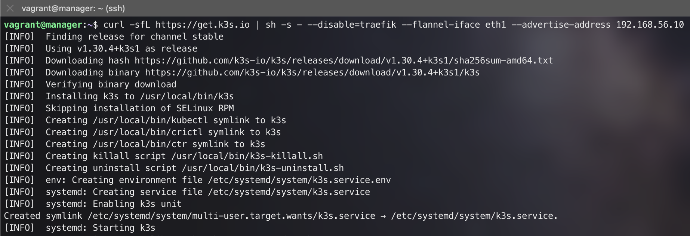

> *Рисунок 2.* Установка *k3s* без Traefik на мастер-узле

Получен токен для подключения воркеров:

```
sudo cat /var/lib/rancher/k3s/server/node-token
```

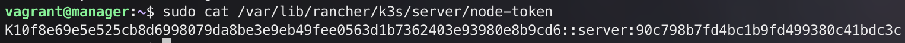

> *Рисунок 3.* Токен для подключения


3) **Подключение рабочих узлов к кластеру**

Воркеры были успешно подключены к мастер-узлу:

```
curl -sfL https://get.k3s.io | K3S_URL=https://192.168.56.10:6443 K3S_TOKEN=<ТОКЕН> sh -s -- --flannel-iface eth1 --node-ip 192.168.56.11
```

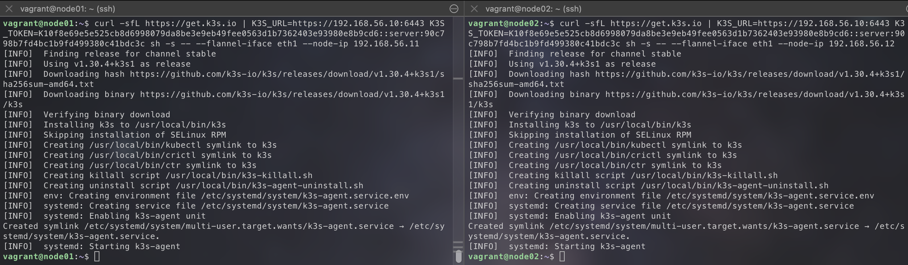

> *Рисунок 4.* Установка на рабочих узлах

Успешное подключение узлов:

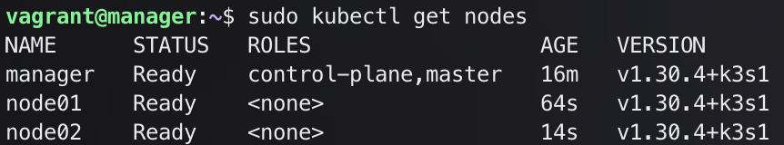

> *Рисунок 5.* Кластер успешно настроен


4) **Установка Nginx Ingress Controller**

Был использован официальный манифест для установки *Ingress Controller Nginx*:

``` bash
kubectl apply -f https://raw.githubusercontent.com/kubernetes/ingress-nginx/main/deploy/static/provider/cloud/deploy.yaml
```

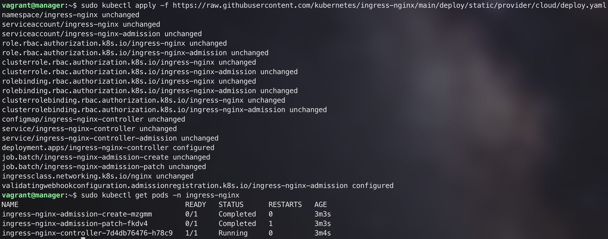

> *Рисунок 6.* *Nginx Ingress Controller* установлен


5) **Установка *cert-manager* и генерация сертификатов**

Для управления сертификатами в кластере установлен *cert-manager*:

``` bash
kubectl apply -f https://github.com/cert-manager/cert-manager/releases/download/v1.11.0/cert-manager.yaml
```

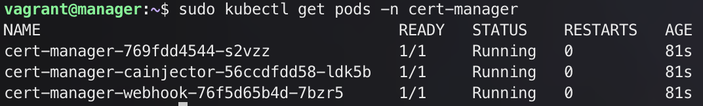

> *Рисунок 7.* Все поды *cert-manager* запущены

Сгенерирован самоподписанный сертификат для локального тестирования.

Применены манифесты:

- [selfsigned-issuer.yaml](./cert/selfsigned-issuer.yaml)
- [selfsigned-cert.yaml](./cert/selfsigned-cert.yaml)

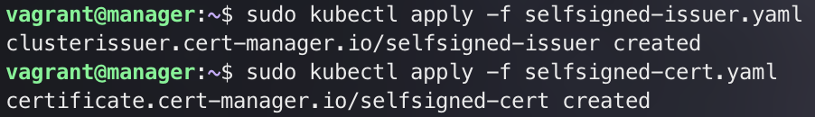

> *Рисунок 8.* Применение манифестов с самоподписанным сертификатом


6) **Создание ресурса *Ingress* и использование сертификата**

Создан и настроен ресурс *Ingress* для использования полученного сертификата.

Применен манифест:

- [webservice-ingress.yaml](./cert/webservice-ingress.yaml)

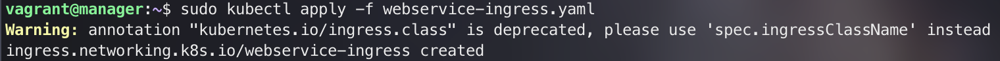

> *Рисунок 9.* Применение манифеста *Ingress*


7) **Создание Persistent Volume для БД PostgreSQL**

Применены манифесты для *PV* и *PVC*:

- [persistent-volume.yaml](./persistent-volume.yaml)

- [persistent-volume-claim.yaml](./persistent-volume-claim.yaml)

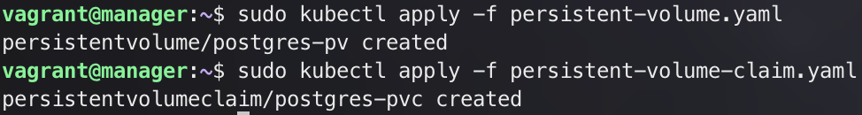

> *Рисунок 10.* Применение манифестов *PV* и *PVC*

Обновленный Deployment базы данных с подключением PVC:

[database-deployment.yaml](./manifest/database-deployment.yaml)

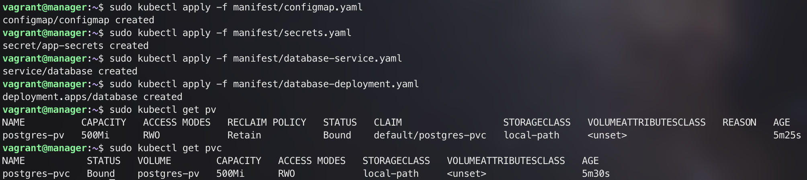

> *Рисунок 11.* Применение первых манифестов приложения

8) **Запуск приложения**

Приложение развернуто путем последовательного применения подготовленных манифестов:

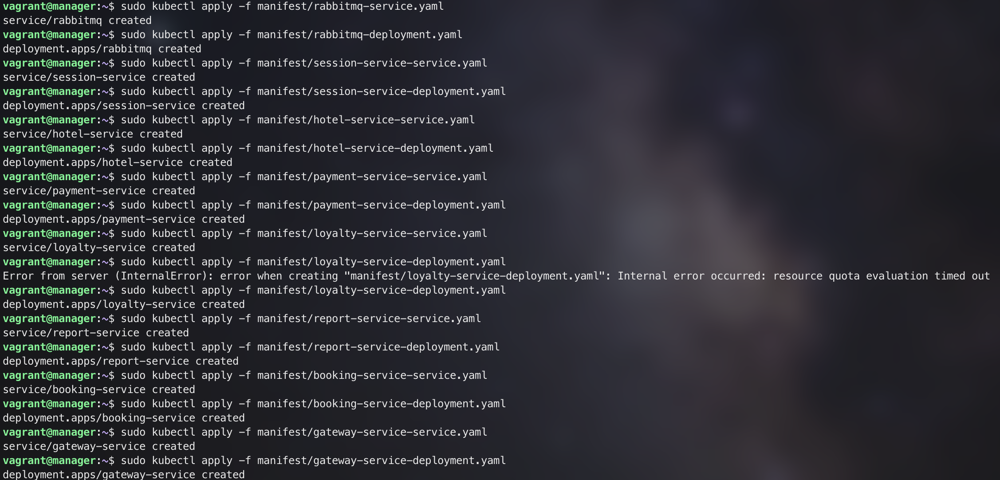

> *Рисунок 12.* Последовательное применение манифестов

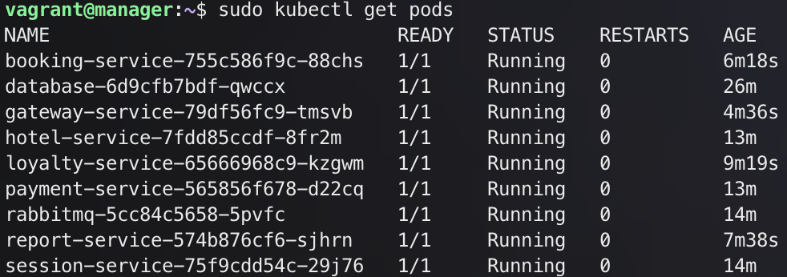

> *Рисунок 13.* Приложение запущено

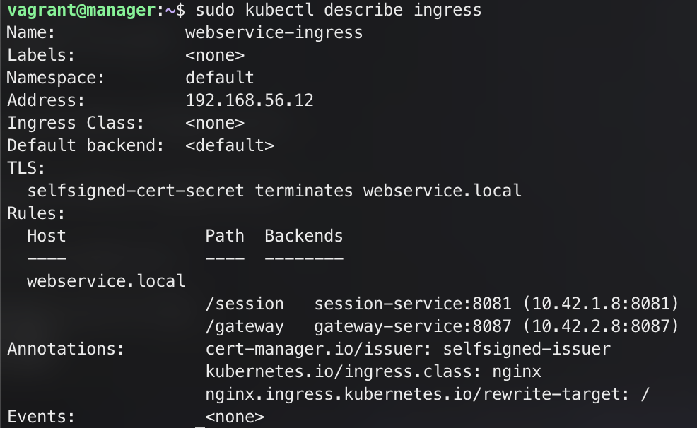

> *Рисунок 14.* Логи *Ingress*

*Ingress* настроен для обработки запросов на *webservice.local* и маршрутизации их к соответствующим сервисам с использованием TLS сертификата, управляемого *cert-manager*. Внешний IP-адрес 192.168.56.12 указывает на доступ к Ingress.

На локальном хосте добавлена строка в `/etc/hosts`:

```
192.168.56.12   webservice.local
```

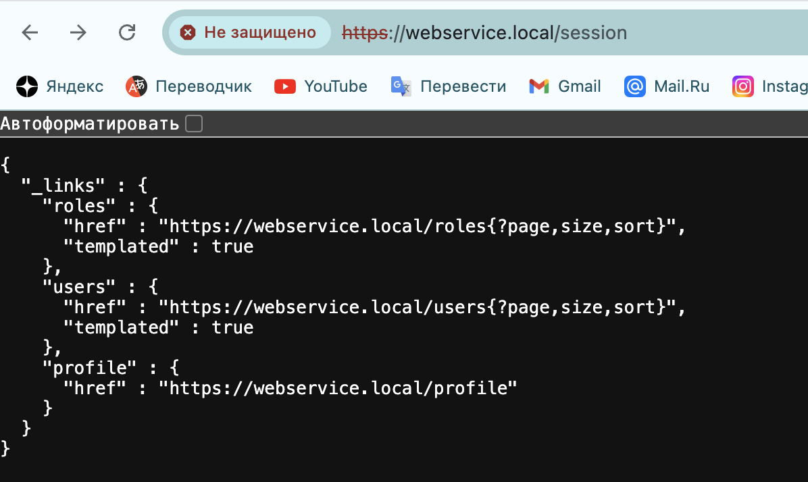

> *Рисунок 15.* Проверка *webservice.local*


9) **Запуск функциональных тестов**

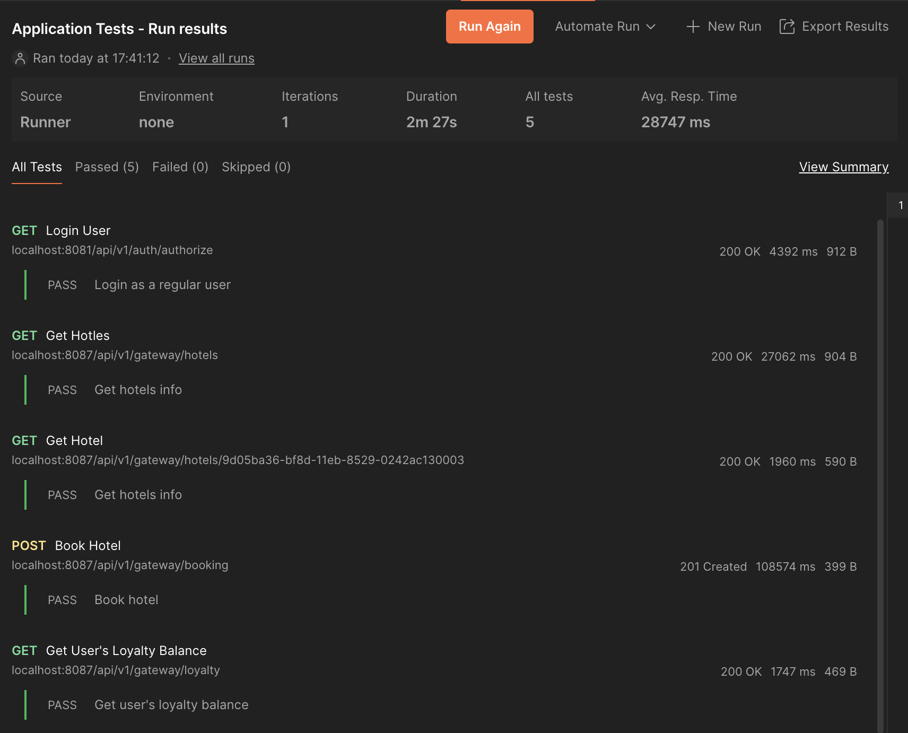

> *Рисунок 16.* Исходные тесты

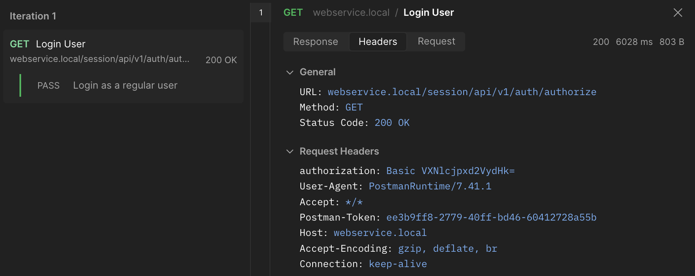

> *Рисунок 17.* Тесты с запросом на `webservice.local`

## Заключение

В данном отчете был продемонстрирован процесс создания собственного кластера *k3s* с использованием альтернативного *Ingress Controller* и управлением сертификатами с помощью *cert-manager*. Выполнена интеграция *Persistent Volume* и развертывание приложения.
