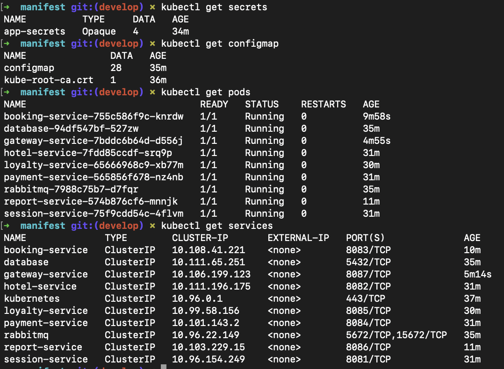

# Основы Kubernetes

## Содержание

1. [Использование готового манифеста](#part-1-использование-гoтового-манифеста)
2. [Создание собственного манифеста](#part-2-создание-собственного-манифеста)

## Part 1. Использование готового манифеста

1) Запуск Kubernetes окружения с 4GB памяти

Для создания локального кластера *Kubernetes* была установлена утилита `Minikube`:

``` bash
brew install minikube
```

Запуск Minikube с выделением 4GB памяти:

``` bash
minikube start --driver=docker --memory=4096
```


> *Рисунок 1.* Запуск Minikube с выделением 4GB памяти

2) Применение готового манифеста из директории `/src/example` к развернутому *Kubernetes* окружению:

```
kubectl apply -f ./example/
```


> *Рисунок 2.* Манифест применен успешно

3) Запуск стандартной панели управления Kubernetes:

``` bash
minikube dashboard
```


> *Рисунок 3.* Открывшийся *Kubernetes Dashboard* в браузере

4) Прокидывание туннелей для доступа к сервисам с помощью команды `minikube service <имя_сервиса>`:

- **Сервис apache**:

```
minikube service apache &
```


> *Рисунок 4.* Туннель для сервиса apache создан

5) Проверка работоспособности развернутого приложения путем доступа к URL, предоставленному Minikube:


> *Рисунок 5.* Работоспособность приложения подтверждена


## Part 2. Создание собственного манифеста

1) Разработка манифестов для приложения, включающих следующие компоненты:
   - [ConfigMap](./manifest/configmap.yaml) для конфигурации хостов БД и сервисов
   - [Секреты](./manifest/secrets.yaml) с логином и паролем для БД и ключами межсервисной авторизации
   - Манифесты подов и сервисов для всех модулей приложения: postgres, rabbitmq и 7 сервисов

Конвертация `docker-compose` файла в *Kubernetes* манифесты:

``` bash
brew install kompose
kompose convert
```


> *Рисунок 6.* Конвертация прошла успешно

- Далее [манифесты](./manifest/) были отредактированы.

2) Запуск приложения путем последовательного применения всех созданных манифестов:


> *Рисунок 7.* Все манифесты успешно применены

3) Проверка статуса созданных объектов:



> *Рисунок 8.* Информация о секретах, конфигурации, подах и сервисах


> *Рисунок 9.* Более детальная информация о секретах и конфигурационной карте

4) Проверка корректности значений секретов:


> *Рисунок 10.* Декодирование секрета

5) Логи приложения:


> *Рисунок 11.* Логи *session-service*

6) Прокидывание туннелей для доступа к сервисам:


> *Рисунок 12.* Туннели прокинуты

7) Запуск функциональных тестов *Postman*:


> *Рисунок 13.* Все тесты успешно пройдены

8) Отображение состояния кластера и компонентов через панель управления *Kubernetes* (`minikube dashboard`):


> *Рисунок 14.* Состояние узлов кластера


> *Рисунок 15.* Список запущенных подов

Для сбора метрик включено дополнение `metrics-server`:

``` bash
minikube addons enable metrics-server
```


> *Рисунок 16.* Нагрузка на CPU и память для подов


> *Рисунок 17.* Логи пода gateway-service

9) Обновление приложения и тестирование стратегий развертывания:

- **Recreate**: Сначала старые поды удаляются, затем создаются новые, что приводит к временному простою приложения.


> *Рисунок 18.* Применение стратегии Recreate

- **Rolling Update**: Обновление происходит постепенно, новые поды заменяют старые, что минимизирует простой.


> *Рисунок 19.* Применение стратегии Rolling Update

> - Стратегия **Recreate** приводит к временному простою.
> - Стратегия **Rolling Update** обеспечивает минимальный простой и плавное обновление приложения.

## Заключение

В ходе работы было успешно развернуто окружение *Kubernetes* с *Minikube* и применены готовые манифесты для запуска приложений. Затем созданы собственные манифесты, включающие конфигурацию, секреты и запуск нескольких взаимосвязанных сервисов. Протестированы две стратегии обновления — **Recreate** и **Rolling Update**, где последняя оказалась более эффективной для минимизации простоев. Итоговые тесты показали корректную работу, что подтвердило успешное развертывание и настройку кластера.
