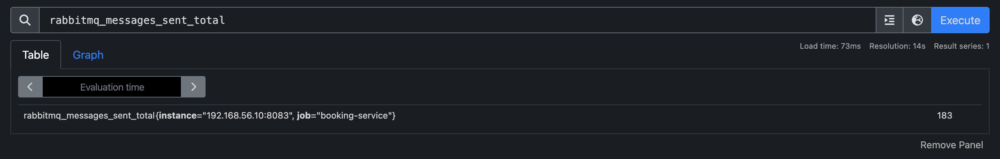
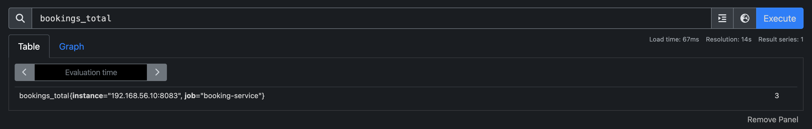
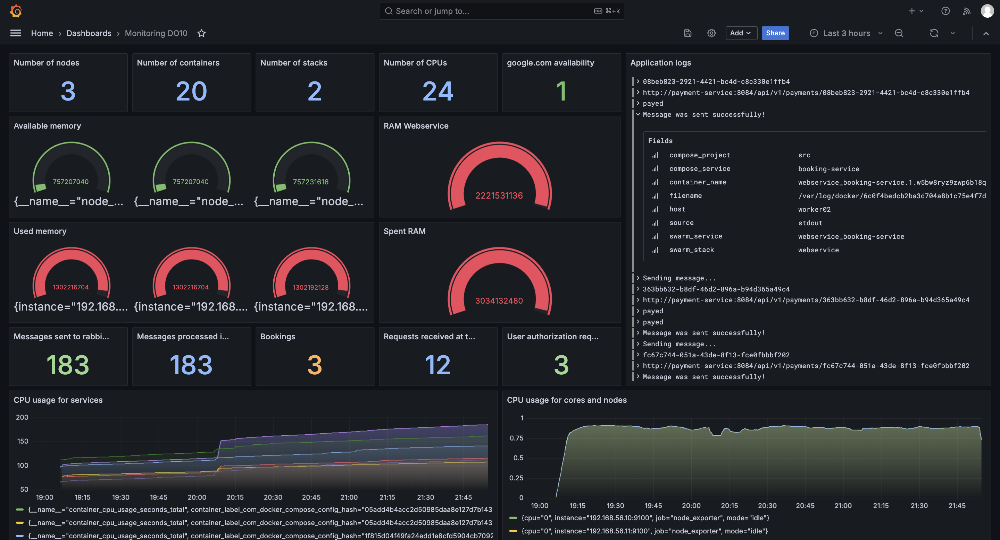
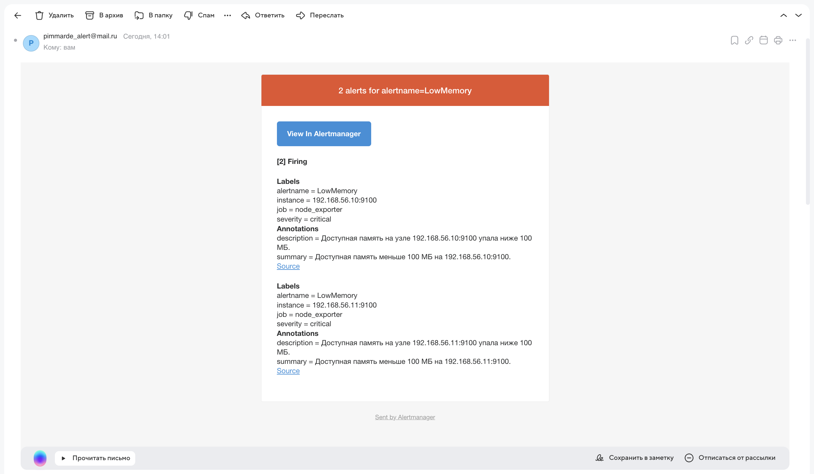
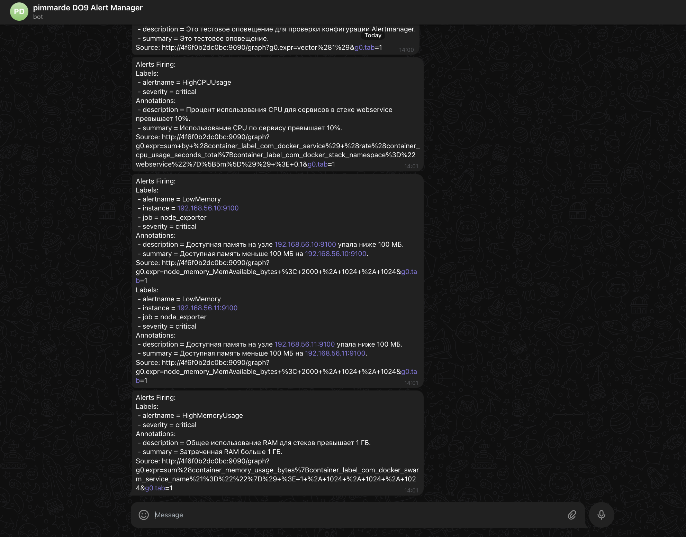
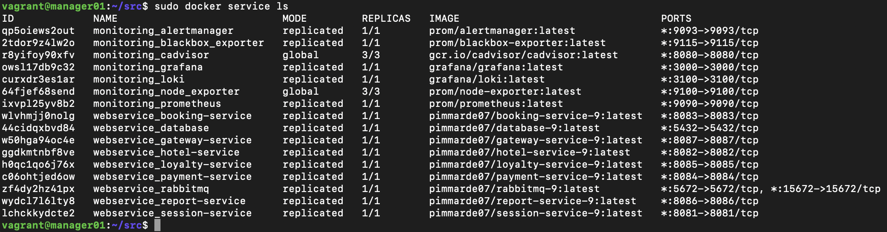

# Мониторинг

## Содержание

1. [Получение метрик и логов](#part-1-получение-метрик-и-логов)
2. [Визуализация](#part-2-визуализация)
3. [Отслеживание критических событий](#part-3-отслеживание-критических-событий)
4. [Итоговый стек](#итоговый-стек)

## Part 1. Получение метрик и логов

1. **Использование Docker Swarm**

   - Импортированы конфигурационные файлы и скрипты из [первого проекта](../DockerSwarm/) для создания среды, необходимой для мониторинга.

2. **Сбор метрик приложения**

   - Написаны сборщики метрик, которые отслеживают важные события в приложении, такие как количество сообщений, количество обработанных запросов, количество бронирований и другие показатели.
   - Для этого в проект были добавлены зависимости для поддержки мониторинга и актуаторов, а также настроены необходимые эндпоинты.

   

   > *Рисунок 1.* Пример отслеживаемой метрики

   

   > *Рисунок 2.* Пример отслеживаемой метрики

   

   > *Рисунок 3.* Пример отслеживаемой метрики

3. **Добавление логов приложения**

   - Для отслеживания логов приложения была настроена система логирования, позволяющая сохранять логи и анализировать их для выявления возможных проблем.

4. **Создание стека для мониторинга**

   - Создан новый [стек](docker-compose-monitoring.yml) в *Docker Swarm*, который включает в себя сервисы для сбора метрик и логов.

## Part 2. Визуализация

1. **Развертывание визуализирующего сервиса**

   - Сервис *grafana* развернут в стеке [мониторинга](./docker-compose-monitoring.yml).

2. **Создание дашборда**

   - Настроен дашборд с множеством метрик, включая использование ресурсов, количество контейнеров и другие важные показатели для анализа состояния системы.

   

   > *Рисунок 4.* Дашборд с метриками

## Part 3. Отслеживание критических событий

1. **Развертывание сервиса для оповещений**

   - В стеке [мониторинга](./docker-compose-monitoring.yml) развернут сервис *alertmanager* для отслеживания критических событий и отправки оповещений.

2. **Настройка правил для отслеживания событий**

   - Определены важные события в [alerts.yml](./alerts.yml), такие как нехватка памяти, превышение использования ресурсов и другие критические состояния, которые требуют внимания.

3. **Настройка уведомлений**

   - Настроены методы оповещения, такие как отправка уведомлений на почту и в телеграме, чтобы своевременно информировать о возникновении критических ситуаций.

   

   > *Рисунок 5.* Пример оповещения о критическом состоянии

   

   > *Рисунок 6.* Оповещение в *telegram*

## Итоговый стек

- Все сервисы мониторинга были успешно развернуты и протестированы, обеспечивая полное покрытие метрик, логов и оповещений.

   

   > *Рисунок 7.* Все сервисы мониторинга в одном стекe

## Заключение

Таким образом, система мониторинга была успешно реализована, обеспечивая сбор, визуализацию и оповещение о метриках и событиях, что позволяет поддерживать высокое качество работы приложения и своевременно реагировать на критические ситуации.
